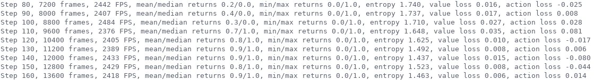

# PyTorch A2C and PPO

This is a very fast, robust, clean and readable PyTorch implementation of:

- [Synchronous A3C (A2C)](https://arxiv.org/pdf/1602.01783.pdf)
- [Proximal Policy Optimization (PPO)](https://arxiv.org/pdf/1707.06347.pdf)

inspered from 3 repositories:

1. [pytorch-a2c-ppo-acktr](https://github.com/ikostrikov/pytorch-a2c-ppo-acktr)
2. [Pytorch RL](https://github.com/Khrylx/PyTorch-RL)
3. [OpenAI Baselines](https://github.com/openai/baselines)

## Important note

If you have a GPU, PyTorch will create additional threads when performing computations which can damage the performance of multiprocessing. This problem is most serious with Linux, where multiprocessing can be even slower than a single thread. You may have to set the OMP_NUM_THREADS to 1:

```
export OMP_NUM_THREADS=1
```

## Features

- Discrete action space
- Entropy regularization
- Very fast (2400 FPS for A2C against 2100 for repo 1 and 1700 for repo 2)
- CUDA (x10 faster than CPU implementation)
- Multiprocessing for collecting agent's trajectories in multiple environments simultaneously (x8 faster than single thread)

## Uses

[MinGrid environments](https://github.com/maximecb/gym-minigrid) are used in the following examples.

### Training

`python3 train.py` enable you to load a model, train it with the actor-critic algorithms and save it.

2 arguments are required:
- `--algo ALGO`: the actor-critic algorithm name.
- `--env ENV`: the environment name to train on.

and a bunch of optional arguments are available among which:
- `--model MODEL`: the name of model, used for saving and loading it. If not specified, it is the `_`-concatenation of the environment name and algorithm name.
- `--step-frames STEP_FRAMES`: number of frames per agent during a training step.
- ... (see more in `train.py`)

Here is an example of command:
```
python3 train.py --algo a2c --env MiniGrid-DoorKey-5x5-v0 --seed 12 --processes 8 --save-interval 10 --step-frames 50
```

<p align="center"></p>

### Enjoying

`python3 enjoy.py` enable you to visualize your trained model acting.

2 arguments are required:
- `--env ENV`: the environment name to act on.
- `--model MODEL`: the trained model name.

and several optional arguments are available (see more in `test.py`).

Here is an example of command:
```
python3 enjoy.py --env MiniGrid-DoorKey-8x8-v0 --model DoorKey
```

<p align="center"></p>

## Todo

- Dictionnary observations
- Recurrent policy
- Reward shaping