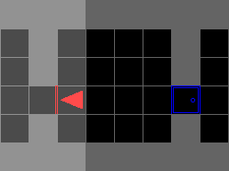

# PyTorch A2C and PPO deep reinforcement learning algorithms

A recurrent, multi-process and readable PyTorch implementation of the deep reinforcement learning algorithms:

- [Synchronous A3C (A2C)](https://arxiv.org/pdf/1602.01783.pdf)
- [Proximal Policy Optimization (PPO)](https://arxiv.org/pdf/1707.06347.pdf)

inspired by 3 repositories:

1. [pytorch-a2c-ppo-acktr](https://github.com/ikostrikov/pytorch-a2c-ppo-acktr)
2. [Pytorch RL](https://github.com/Khrylx/PyTorch-RL)
3. [OpenAI Baselines](https://github.com/openai/baselines)

## Features

- Tensor or dict of tensors observation space
- Discrete & continuous action space
- Entropy regularization
- Reward shaping
- Recurrent policy by specifying recurrence length
- Fast:
    - Multiprocessing for collection trajectories in multiple environments simultaneously
    - GPU (CUDA) for tensor operations
- Tensorboard
- Pytorch 0.4.0

## Installation

The first option is to directly install the `torch_ac` module with:
```
pip3 install https://github.com/lcswillems/pytorch-a2c-ppo/archive/master.zip
```

To get updates from the code, you will need to execute again this command.

However, this command will not allow you to use the additionnal scripts in the `scripts` folder.

The second option is to clone the repository and then install the module:
```
pip3 install -e .
```

To gets updates from the code, you will need to execute again this command after a `git pull`.

## `torch_ac` module

The module consists of:
- 2 classes `torch_ac.A2CAlgo` and `torch_ac.PPOAlgo` for, respectively, A2C and PPO algorithms
- 2 abstract classes `torch_ac.ACModel` and `torch_ac.RecurrentACModel` for, respectively, non-recurrent and recurrent actor-critic models
- 1 class `torch_ac.DictList` for making dictionnaries of lists batch-friendly

### How to use?

I will detail here the points that can't be understood immediately by looking at the definition files of the classes, or by looking at the arguments of `scripts/train.py` with `scripts/train.py --help` command.

`torch_ac.A2CAlgo` and `torch_ac.PPOAlgo` have 2 methods:
- `__init__` that may take, among the other parameters :
    - an `acmodel` actor-critic model that is an instance of a class that inherits from one of the two abstract classes `torch_ac.ACModel` or `torch_ac.RecurrentACModel`.
    - a `preprocess_obss` function that transforms a list of observations given by the environment into an object `X`. This object `X` must allow to retrieve from it a sublist of preprocessed observations given a list of indexes `indexes` with `X[indexes]`. By default, the observations given by the environment are transformed into a Pytorch tensor.
    - a `reshape_reward` function that takes into parameter an observation `obs`, the action `action` of the model, the reward `reward` and the terminal status `done` and returns a new reward.
    - a `recurrence` number to specify over how many timestep gradient will be backpropagated. This number is only considered if a recurrent model is used and **must divide** the `num_frames_per_agent` parameter and, for PPO, the `batch_size` parameter.
- `update_parameters` that returns some logs.

`torch_ac.ACModel` has 2 abstract methods:
- `__init__` that takes into parameter the `observation_space` and the `action_space` given by the environment.
- `forward` that takes into parameter N preprocessed observations `obs` and returns a Pytorch distribution `dist` and a tensor of values `value`. The tensor of values **must be** of size N, not N x 1.

`torch_ac.RecurrentACModel` has 3 abstract methods:
- `__init__` that takes into parameter the same parameters than `torch_ac.ACModel`.
- `forward` that takes into parameter the same parameters than `torch_ac.ACModel` along with a tensor of N memories `memory` of size N x M where M is the size of a memory. It returns the same thing than `torch_ac.ACModel` plus a tensor of N memories `memory`.
- `memory_size` that returns the size M of a memory.

For speed purposes, the observations are only preprocessed once. Hence, because of the use of batches in PPO, the preprocessed observations `X` must allow to retrieve from it a sublist of preprocessed observations given a list of indexes `indexes` with `X[indexes]`. If your preprocessed observations are a Pytorch tensor, you are already done, and if you want your preprocessed observations to be a dictionnary of lists or of tensors, you will also be already done if you use the `torch_ac.DictList` class as follow:

```python
>>> d = DictList({"a": [[1, 2], [3, 4]], "b": [[5], [6]]})
>>> d.a
[[1, 2], [3, 4]]
>>> d[0]
DictList({"a": [1, 2], "b": [5]})
```

**Note :** if you use a RNN, you will need to set `batch_first` to `True`.

### Examples

An example of use of `torch_ac.A2CAlgo` and `torch_ac.PPOAlgo` classes is given in `scripts/train.py`.

An example of implementation of `torch_ac.ACModel` and `torch_ac.RecurrentACModel` abstract classes is given in `models/img_instr.py` and `models/img_instr_mem.py` respectively.

An example of use of `torch_ac.DictList` and an example of a `preprocess_obss` function is given in the `ObsPreprocessor.__call__` function of `utils/format.py`.

## Note before using

`OMP_NUM_THREADS` affects the number of threads used by MKL. The default value may severly damage your performance. This may be avoided if set to 1:

```
export OMP_NUM_THREADS=1
```

## `scripts`

Along with the `torch_ac` package, I provide 3 general reinforcement learning scripts:
- `train.py` for training a actor-critic model with A2C or PPO.
- `enjoy.py` for visualizing your trained model acting.
- `evaluate.py` for evaluating the performances of your trained model over X episodes.

For your own purposes, you will probabily need to change models in the `models` folder, the line `from models.img_instr import ACModel` in `utils/model.py`, the `ObssPreprocessor.__call__` method and `reshape_reward` function in `utils.format`.

They were designed especially for the [MiniGrid environments](https://github.com/maximecb/gym-minigrid). These environments give an observation containing an image and a textual instruction. They are used in what follows for illustrating purposes.

These scripts assume that you have already installed the `gym` package (with `pip3 install gym` for example). If you have not installed `gym_minigrid` and don't want to install it, you will have to remove the `import gym_minigrid` lines in all the scripts.

### `train.py`

`scripts/train.py` enables you to load a model, trains it with the actor-critic algorithm specified and save it in the `storage/models` folder.

2 arguments are required:
- `--algo ALGO`: name of the actor-critic algorithm.
- `--env ENV`: name of the environment to train on.

and a bunch of optional arguments are available among which:
- `--model MODEL`: name of the model, used for loading and saving it. If not specified, it is the `_`-concatenation of the environment name and algorithm name.
- `--frames-per-proc FRAMES_PER_PROC`: number of frames per process before updating parameters.
- ... (see more using `--help`)

Here is an example of command:
```
scripts/train.py --algo ppo --env MiniGrid-DoorKey-5x5-v0 --model DoorKey --save-interval 10 --frames 1000000
```

**Note:** if you have not installed `torch_ac`, you will have to replace `scripts/train.py` by `python3 -m scripts.train`.

This will print some logs in your terminal:

<p align="center"></p>

where:
- "U" is for "Update".
- "F" is for "Total number of frames".
- "FPS" is for "frame per second".
- "D" is for "duration".
- "rR" is for "reshaped return". The 4 following numbers are, in the order, the mean, the standard deviation, the minimum, the maximum of the reshaped return per episode during the update.
- "F" is for the number of "Frame". The 4 following numbers are again, in the order, the mean, the standard deviation, the minimum, the maximum of the number of frames per episode during the update.
- "H" is for "Entropy".
- "V" is for "Value".
- "pL" is for "Policy loss".
- "vL" is for "Value loss".

These logs are also saved in a log file in `storage/logs`.

By default, logs are also plotted in Tensorboard using the `tensorboardX` package that you can install with `pip3 install tensorboardX`. You just have to execute:

```tensorboard --logdir storage/logs```

and you will get something like this:

<p align="center"></p>
<p align="center"></p>

If you don't want to use Tensorboard, you will have to add `--no-tb` to the command.

### `enjoy.py`

`scripts/enjoy.py` enables you to visualize your trained model acting.

2 arguments are required:
- `--env ENV`: name of the environment to act on.
- `--model MODEL`: name of the trained model.

and several optional arguments are available (see more using `--help`).

Here is an example of command:
```
scripts/enjoy.py --env MiniGrid-DoorKey-5x5-v0 --model DoorKey
```

**Note:** if you have not installed `torch_ac`, you will have to replace `scripts/enjoy.py` by `python3 -m scripts.enjoy`.

In the `MiniGrid-DoorKey-6x6-v0` environment, the agent has to reach the green goal. In particular, it has to learn how to open a locked door.

<p align="center"></p>

In the `MiniGrid-GoToDoor-5x5-v0` environment, the agent has to open a door specified by its color. In particular, it has to understand textual instructions.

<p align="center"></p>

In the `MiniGrid-RedBlueDoors-6x6-v0` environment, the agent has to open the red door and then the blue door. Because the agent initially faces the blue door, it has to remember if the red door is opened.

<p align="center"></p>

### `evaluate.py`

`scripts/evaluate.py` enables you to evaluate the performance of your trained model on X episodes.

2 arguments are required:
- `--env ENV`: name of the environment to act on.
- `--model MODEL`: name of the trained model.

and several optional arguments are available (see more using `--help`).

By default, the model is tested on 100 episodes with a random seed set to 2 instead of 1 during training.

Here is an example of command:
```
scripts/evaluate.py --env MiniGrid-DoorKey-5x5-v0 --model DoorKey
```

**Note:** if you have not installed `torch_ac`, you will have to replace `scripts/evaluate.py` by `python3 -m scripts.evaluate`.

This will print the evaluation in your terminal:

<p align="center"></p>

where "R" is for "return".