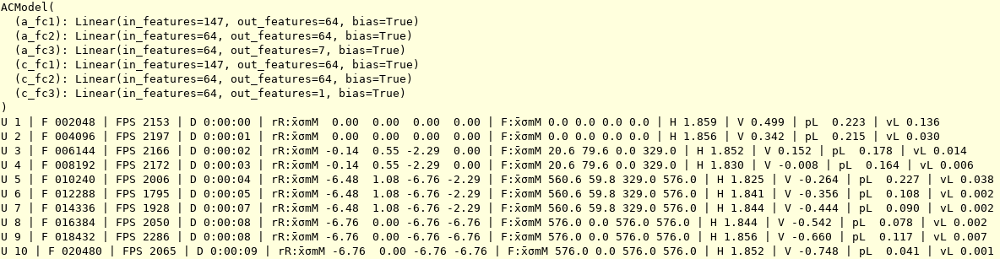
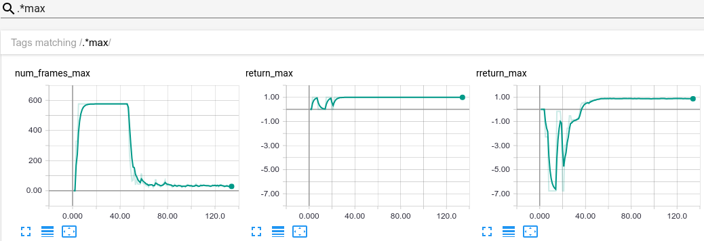
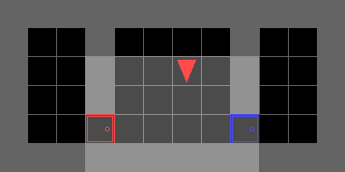

# PyTorch A2C and PPO deep reinforcement learning algorithms

A recurrent, multi-process and readable PyTorch implementation of the deep reinforcement learning algorithms:

- [Synchronous A3C (A2C)](https://arxiv.org/pdf/1602.01783.pdf)
- [Proximal Policy Optimization (PPO)](https://arxiv.org/pdf/1707.06347.pdf)

inspired by 3 repositories:

1. [pytorch-a2c-ppo-acktr](https://github.com/ikostrikov/pytorch-a2c-ppo-acktr)
2. [PyTorch RL](https://github.com/Khrylx/PyTorch-RL)
3. [OpenAI Baselines](https://github.com/openai/baselines)

## Features

- General kinds of observation spaces: tensors and dict of tensors
- General kinds of action spaces: discrete and continuous
- Recurrent policy with `--recurrence` argument
- Observation preprocessing
- Reward shaping
- Entropy regularization
- Fast:
    - Multiprocessing for collection trajectories in multiple environments simultaneously
    - GPU (CUDA) for tensor operations
- Training logs:
    - CSV
    - Tensorboard
- PyTorch 0.4.0

## Installation

You have to clone the repository and then install the module:
```
pip3 install -e torch_rl
```

To gets updates from the code, you just need to do a `git pull`. No need to install the module again.

## `torch_rl` module

The module consists of:
- 2 classes `torch_rl.A2CAlgo` and `torch_rl.PPOAlgo` for, respectively, A2C and PPO algorithms
- 2 abstract classes `torch_rl.ACModel` and `torch_rl.RecurrentACModel` for, respectively, non-recurrent and recurrent actor-critic models
- 1 class `torch_rl.DictList` for making dictionnaries of lists batch-friendly

### How to use?

Here are detailed the points that can't be understood immediately by looking at the definition files of the classes, or by looking at the arguments of `scripts/train.py` with `scripts/train.py --help` command.

`torch_rl.A2CAlgo` and `torch_rl.PPOAlgo` have 2 methods:
- `__init__` that may take, among the other parameters :
    - an `acmodel` actor-critic model that is an instance of a class that inherits from one of the two abstract classes `torch_rl.ACModel` or `torch_rl.RecurrentACModel`.
    - a `preprocess_obss` function that transforms a list of observations given by the environment into an object `X`. This object `X` must allow to retrieve from it a sublist of preprocessed observations given a list of indexes `indexes` with `X[indexes]`. By default, the observations given by the environment are transformed into a Pytorch tensor.
    - a `reshape_reward` function that takes into parameter, in the order, an observation `obs`, the action `action` of the model, the reward `reward` and the terminal status `done` and returns a new reward.
    - a `recurrence` number to specify over how many timestep gradient will be backpropagated. This number is only considered if a recurrent model is used and **must divide** the `num_frames_per_agent` parameter and, for PPO, the `batch_size` parameter.
- `update_parameters` that returns some logs.

`torch_rl.ACModel` has 2 abstract methods:
- `__init__` that takes into parameter the `observation_space` and the `action_space` given by the environment.
- `forward` that takes into parameter N preprocessed observations `obs` and returns a Pytorch distribution `dist` and a tensor of values `value`. The tensor of values **must be** of size N, not N x 1.

`torch_rl.RecurrentACModel` has 3 abstract methods:
- `__init__` that takes into parameter the same parameters than `torch_rl.ACModel`.
- `forward` that takes into parameter the same parameters than `torch_rl.ACModel` along with a tensor of N memories `memory` of size N x M where M is the size of a memory. It returns the same thing than `torch_rl.ACModel` plus a tensor of N memories `memory`.
- `memory_size` that returns the size M of a memory.

For speed purposes, the observations are only preprocessed once. Hence, because of the use of batches in PPO, the preprocessed observations `X` must allow to retrieve from it a sublist of preprocessed observations given a list of indexes `indexes` with `X[indexes]`. If your preprocessed observations are a Pytorch tensor, you are already done, and if you want your preprocessed observations to be a dictionnary of lists or of tensors, you will also be already done if you use the `torch_rl.DictList` class as follow:

```python
>>> d = DictList({"a": [[1, 2], [3, 4]], "b": [[5], [6]]})
>>> d.a
[[1, 2], [3, 4]]
>>> d[0]
DictList({"a": [1, 2], "b": [5]})
```

**Note :** if you use a RNN, you will need to set `batch_first` to `True`.

### Examples

An example of use of `torch_rl.A2CAlgo` and `torch_rl.PPOAlgo` classes is given in `scripts/train.py`.

An example of implementation of `torch_rl.RecurrentACModel` abstract class is given in `model.py`.

An example of use of `torch_rl.DictList` and an example of a `preprocess_obss` function is given in the `ObsPreprocessor.__call__` function of `utils/format.py`.

## Note before using

`OMP_NUM_THREADS` affects the number of threads used by MKL. The default value may severly damage your performance. This may be avoided if set to 1:

```
export OMP_NUM_THREADS=1
```

For your own purposes, you will probabily need to change:
- the model in `model.py`,
- the `ObssPreprocessor.__call__` method in `utils.format`.

## `model.py`

Along with the `torch_rl` package is provided a model that:
- has a memory. This can be disabled by setting `use_memory` to `False` in the constructor.
- understands instructions. This can be disabled by setting `use_instr` to `False` in the constructor.

## `scripts`

Along with the `torch_rl` package are provided 3 general reinforcement learning scripts:
- `train.py` for training an actor-critic model with A2C or PPO.
- `enjoy.py` for visualizing your trained model acting.
- `evaluate.py` for evaluating the performances of your trained model over X episodes.

These scripts were designed especially for the [MiniGrid environments](https://github.com/maximecb/gym-minigrid). These environments give an observation containing an image and a textual instruction to the agent and a reward of 1 if it successfully executes the instruction, 0 otherwise. They are used in what follows for illustrating purposes.

These scripts assume that you have already installed the `gym` package (with `pip3 install gym` for example). By default, models and logs are stored in the `storage` folder. You can define a different folder in the environment variable `TORCH_RL_STORAGE`.

### `train.py`

`scripts/train.py` enables you to load a model, trains it with the specified actor-critic algorithm and save it in the `storage` folder.

2 arguments are required:
- `--algo ALGO`: name of the actor-critic algorithm.
- `--env ENV`: name of the environment to train on.

and a bunch of optional arguments are available among which:
- `--model MODEL`: name of the model, used for loading and saving it. If not specified, it is the `_`-concatenation of the environment name and algorithm name.
- `--frames-per-proc FRAMES_PER_PROC`: number of frames per process before updating parameters.
- `--no-instr`: disable the understanding of instructions of the original model in `model.py`. If your model is trained on an environment where there is no need to understand instructions, it is advised to disable it for faster training.
- `--no-mem`: disable the memory of the original model in `model.py`. If your model is trained on an environment where there is no need to remember something, it is advised to disable it for faster training.
- ... (see more using `--help`)

Here is an example of command:
```
python3 -m scripts.train --algo ppo --env MiniGrid-DoorKey-5x5-v0 --no-instr --no-mem --model DoorKey --save-interval 10
```

This will print some logs in your terminal:

<p align="center"></p>

where:
- "U" is for "Update".
- "F" is for the total number of "Frames".
- "FPS" is for "Frames Per Second".
- "D" is for "Duration".
- "rR" is for "reshaped Return" per episode. The 4 following numbers are, in the order, the mean `x̄`, the standard deviation `σ`, the minimum `m` and the maximum `M` of the reshaped return per episode during the update.
- "F" is for the number of "Frames" per episode. The 4 following numbers are again, in the order, the mean, the standard deviation, the minimum, the maximum of the number of frames per episode during the update.
- "H" is for "Entropy".
- "V" is for "Value".
- "pL" is for "policy Loss".
- "vL" is for "value Loss".
- "∇" is for the gradient norm.

These logs are also saved in a logging format in `log.log` and in a CSV format in `log.csv` in the `storage` folder.

If you add `--tb` to the command, logs are also plotted in Tensorboard using the `tensorboardX` package that you can install with `pip3 install tensorboardX`. Then, you just have to execute:

```tensorboard --logdir storage```

and you will get something like this:

<p align="center"></p>
<p align="center"></p>

### `enjoy.py`

`scripts/enjoy.py` enables you to visualize your trained model acting.

2 arguments are required:
- `--env ENV`: name of the environment to act on.
- `--model MODEL`: name of the trained model.

and several optional arguments are available (see more using `--help`).

Here is an example of command:
```
python3 -m scripts.enjoy --env MiniGrid-DoorKey-5x5-v0 --model DoorKey
```

In the `MiniGrid-DoorKey-6x6-v0` environment, the agent has to reach the green goal. In particular, it has to learn how to open a locked door.

<p align="center"></p>

In the `MiniGrid-GoToDoor-5x5-v0` environment, the agent has to open a door specified by its color. In particular, it has to understand textual instructions.

<p align="center"></p>

In the `MiniGrid-RedBlueDoors-6x6-v0` environment, the agent has to open the red door and then the blue door. Because the agent initially faces the blue door, it has to remember if the red door is opened.

<p align="center"></p>

### `evaluate.py`

`scripts/evaluate.py` enables you to evaluate the performance of your trained model on X episodes.

2 arguments are required:
- `--env ENV`: name of the environment to act on.
- `--model MODEL`: name of the trained model.

and several optional arguments are available (see more using `--help`).

By default, the model is tested on 100 episodes with a random seed set to 2 instead of 1 during training.

Here is an example of command:
```
python3 -m scripts.evaluate --env MiniGrid-DoorKey-5x5-v0 --model DoorKey
```

This will print the evaluation in your terminal:

<p align="center"></p>

where "R" is for "Return" per episode.